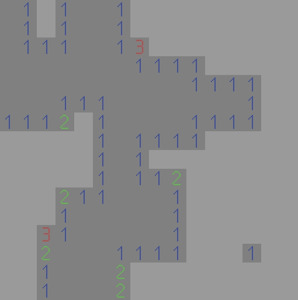

# Reinforcement Learning Minesweeper
Reinforcement learning program playing Minesweeper, created using StableBaselines3, Gymnasium, CUDA and Pytorch. Documented and compared algorithms: MaskablePPO, PPO and A2C.   
  
# Requirements
- Windows 
- Python 3.11
- [Miniconda](https://docs.anaconda.com/free/miniconda/index.html)
- CUDA 12.4 (Optional)
# Miniconda setup
- During or after installation set enviornement variable to `.../miniconda3` directory
- Create enviornement `conda create .../python-minesweeper-main/.conda` or `Create enviornement...` option in Visual Studio Code
- Activate enviornement `activate`
- `pip install -r requirements.txt`
